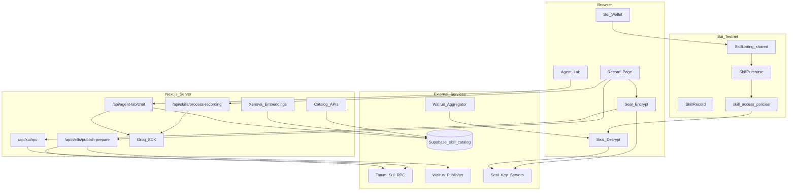
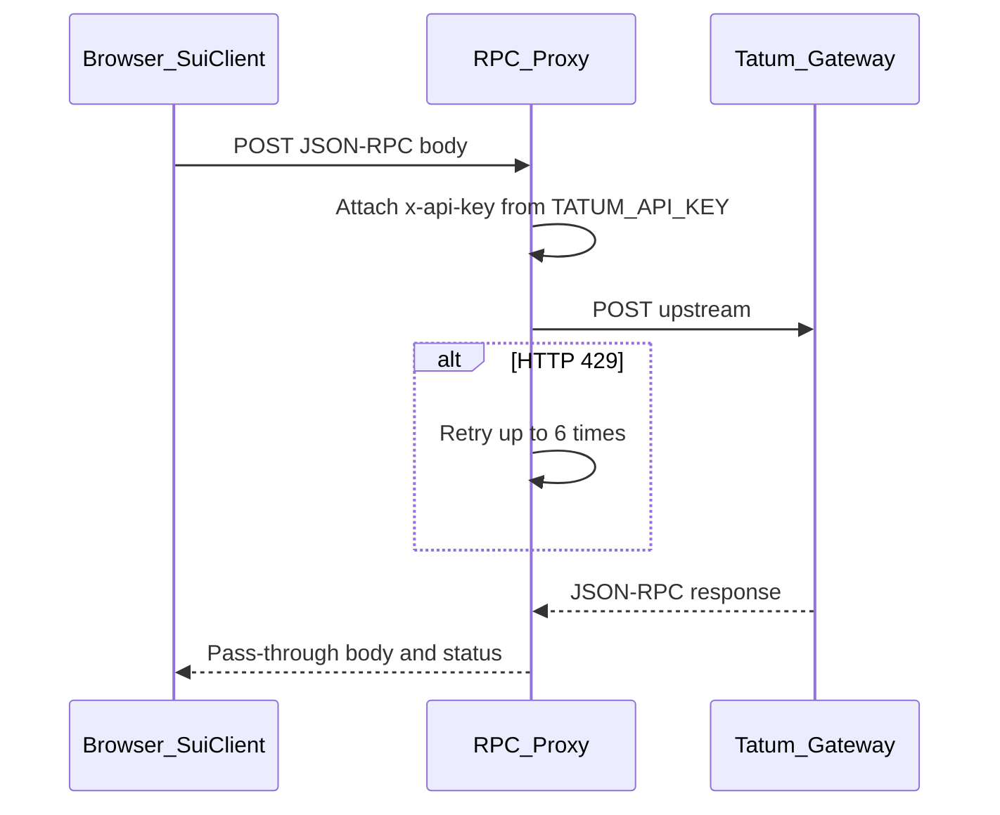
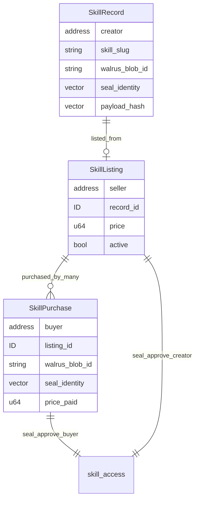
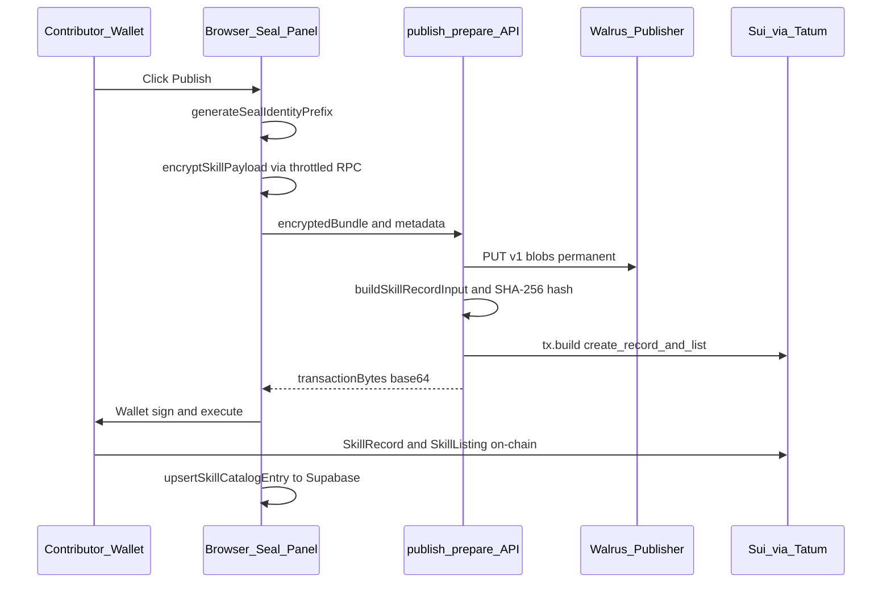
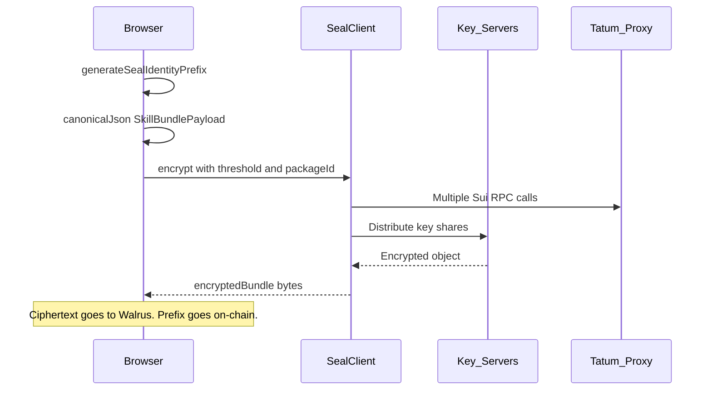
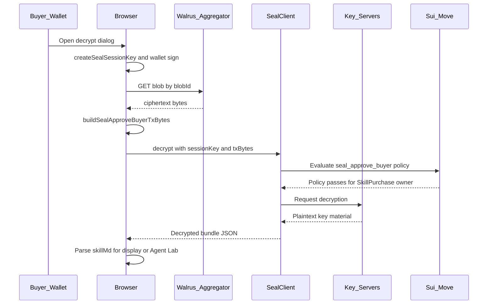
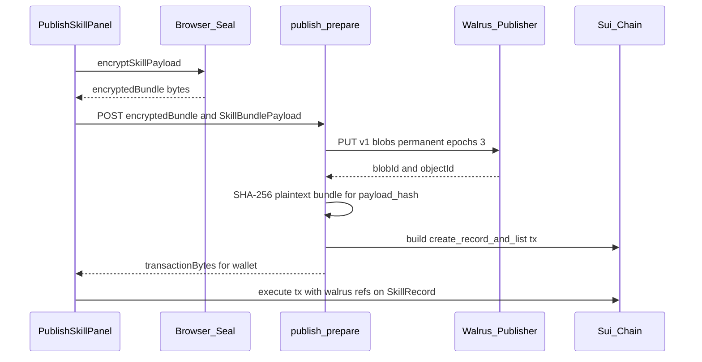
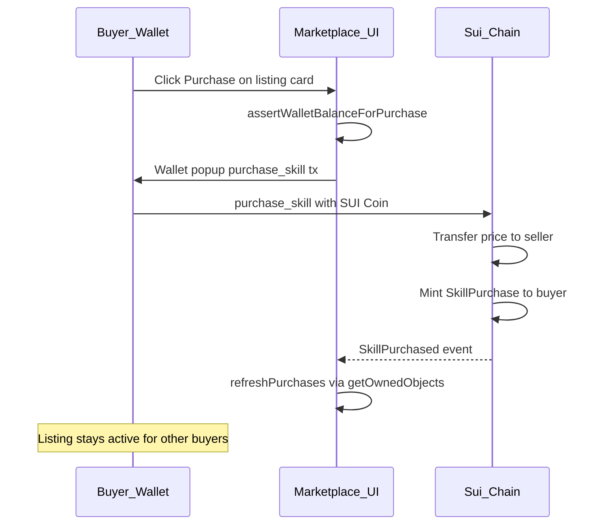

# OpenClu 

## On-chain Skill Capture & Marketplace

**A decentralized platform where anyone records a screen walkthrough of work they already know how to do, and OpenClu converts that demonstration into a structured skill any AI agent can load — encrypted on Walrus, sold on Sui, and testable in Agent Lab.**

---
<!-- TOC -->
## Table of Contents

- [Executive Summary](#executive-summary)
- [Important Links](#important-links)
- [How to Demo](#how-to-demo)
- [Introduction](#introduction)
- [The Problem We Solve](#the-problem-we-solve)
- [Example User: Priya the DevOps Engineer](#example-user-priya-the-devops-engineer)
- [Technology Stack](#technology-stack)
- [System Architecture](#system-architecture)
- [Complete Pipeline Flow](#complete-pipeline-flow)
- [Tatum RPC Integration — Architecture and Innovation](#tatum-rpc-integration--architecture-and-innovation)
- [Sui Integration — Architecture and Innovation](#sui-integration--architecture-and-innovation)
- [Seal Integration — Architecture and Innovation](#seal-integration--architecture-and-innovation)
- [Walrus Storage Integration](#walrus-storage-integration)
- [Supabase Catalog & Semantic Search](#supabase-catalog--semantic-search)
- [Agent Marketplace](#agent-marketplace)
- [Agent Lab](#agent-lab)
- [Smart Contracts — Deep Dive](#smart-contracts--deep-dive)
- [API Reference](#api-reference)
- [Product Roadmap](#product-roadmap)
- [Conclusion](#conclusion)

---

## Executive Summary

**OpenClu** lets people record **any skill they can demonstrate on screen** and turn it into something an AI agent can actually use. A contributor performs the task while narrating their thinking; the platform extracts a structured `SKILL.md` that encodes their exact methodology — steps, decision branches, rules, and context. That skill is **Seal-encrypted**, stored on **Walrus**, listed on **Sui**, and sold to buyers who receive on-chain `SkillPurchase` receipts that unlock decryption. **Supabase** indexes listing metadata for browse and semantic search; **Agent Lab** lets buyers attach purchased skills to an agent and verify the skill works before deploying it elsewhere.

**Primitives we built on:**

- **Tatum Sui JSON-RPC** — Production-grade gateway for all chain reads and transaction execution, with a browser-safe proxy that attaches `x-api-key` server-side (CORS-safe)
- **Sui + @mysten/dapp-kit** — Wallet connect (Phantom, Slush, Suiet), `SkillRecord` / `SkillListing` / `SkillPurchase` object model, SUI micropayments
- **Mysten Seal** — Threshold encryption (default **2-of-2** key servers); on-chain `skill_access` policies approve decryption for buyers and creators
- **Walrus** — Permanent blob storage for encrypted skill bundles; chain stores blob IDs and SHA-256 payload hashes only
- **Groq** — Transcription, vision, and SKILL.md extraction from recordings; Agent Lab chat runtime
- **Supabase + pgvector** — Metadata-only catalog (no skill content); HNSW semantic search via `Xenova/all-MiniLM-L6-v2` embeddings

> OpenClu is built for experts who already know how to do the work — DevOps engineers debugging incidents, designers walking through critique workflows, operators running internal tools — and want to pass that **exact thinking process** to agents without writing documentation by hand.

---

## Important Links

| Resource | Link |
|----------|------|
| **Demo video** | [View Here](https://youtu.be/4wAhp2MTCtk) |
| **Pitch deck** | [View Here](https://canva.link/5o7qyzlmv6g0fum) |
| **Live app (Try out now!)** | [https://opeclu-sui.vercel.app](https://opeclu-sui.vercel.app) |

### Deployed Package (Sui Testnet)

| Artifact | Value |
|----------|-------|
| **Package ID** | `0x49741207d777cb57588d092f900c7e15724fd36f75b238232e9d91ee09b05c20` |
| **Deployer** | `0xcf2d73f05c9d8f9c2ea92f1aea53d291785af73dc48c74e071cc4c180de2f2d0` |
| **Publish digest** | `H587yJKDHRWWaDiKddFypET4Q1C7Riy2h5yRRbLdzPg5` |
| **Modules** | `skill_record`, `skill_marketplace`, `skill_access` |
| **Published at** | 2026-06-02 |
| **Artifact file** | [`frontend/deployments/testnet.json`](frontend/deployments/testnet.json) |

**Explorer:** [Sui Scan — package](https://suiscan.xyz/testnet/object/0x49741207d777cb57588d092f900c7e15724fd36f75b238232e9d91ee09b05c20)

### Key Source Paths

| Area | Path |
|------|------|
| Tatum RPC | [`frontend/src/lib/sui/tatum-rpc.ts`](frontend/src/lib/sui/tatum-rpc.ts) |
| RPC proxy | [`frontend/src/app/api/sui/rpc/route.ts`](frontend/src/app/api/sui/rpc/route.ts) |
| Seal | [`frontend/src/lib/seal/`](frontend/src/lib/seal/) |
| Walrus HTTP | [`frontend/src/lib/sui/walrus-http.ts`](frontend/src/lib/sui/walrus-http.ts) |
| Sui publish | [`frontend/src/lib/sui/publish.ts`](frontend/src/lib/sui/publish.ts) |
| Move contracts | [`contracts/openclu_skill/sources/`](contracts/openclu_skill/sources/) |
| Agent Lab | [`frontend/src/lib/agent-lab/groq-agent.ts`](frontend/src/lib/agent-lab/groq-agent.ts) |
| Marketplace | [`frontend/src/app/marketplace/page.tsx`](frontend/src/app/marketplace/page.tsx) |

---

## How to Demo

End-to-end walkthrough of the live app on **Sui testnet**. You need a funded testnet wallet (gas + listing/purchase SUI). Phantom is supported, but we **recommend Slush** — Phantom has had intermittent issues with transaction signing in our tests.

1. **Open the app** — Go to [https://opeclu-sui.vercel.app](https://opeclu-sui.vercel.app). You are redirected to `/login` until a wallet is connected.

2. **Connect wallet** — Click **Connect wallet**, choose **Slush** (or another Sui wallet), and confirm the wallet is on **testnet** with enough SUI for gas and purchases.

3. **Record a skill** — Open **Record** (`/record`). Fill in title and description, then click **Start recording**. Share your screen and narrate any walkthrough (e.g. using an app, changing a PC setting). Click **Stop recording** when done; wait for extraction to finish and review the generated **SKILL.md**.


4. **Publish to marketplace** — Scroll to **Publish to Walrus + Sui**, set a list price (default **0.1 SUI**), and click **Publish skill on-chain**. Approve the wallet popup — the flow Seal-encrypts the bundle, uploads to Walrus, and creates `SkillRecord` + `SkillListing` on-chain. Confirm success in the result modal.


5. **Purchase a skill** — Open **Marketplace** (`/marketplace`), **Browse** tab. Pick a listing you do **not** own (you cannot buy your own skill), click **Purchase**, and approve the `purchase_skill` transaction. The card switches to **Owned** when the receipt is on-chain.


6. **Test in Agent Lab** — Open **Agent lab** (`/create-agent`). In the skills palette, click **Decrypt** on your purchase, sign the Seal session message, then **drag the skill onto the canvas** agent node. Use the chat panel to ask the agent to perform a task — it loads your decrypted `SKILL.md` as context.


7. **Discover skills via chat** — In Agent lab chat, ask something like *"Find a skill for screen recording"* or *"Find a skill for debugging deployments."* The agent runs a semantic marketplace search and shows a skill offer card — purchase, decrypt, and attach from there to test it on the canvas.

---

## Introduction

**OpenClu is for people to record any skill they can provide to an AI agent — by simply screen-recording themselves doing the action.**

You do not need to write prompts, design doc templates, or agent frameworks. You perform the task the way you always do, narrate your reasoning as you go, and OpenClu converts that recording into a structured skill an agent can load. The skill captures your **exact thinking process and methodology** — not a generic summary, but the sequence of checks, tools, heuristics, and decisions you actually follow.

A DevOps engineer debugging a production incident can record their screen while they trace logs, inspect metrics, isolate the failing service, and apply a fix. A security reviewer can record how they walk a PR for auth bugs. A customer-success lead can record how they triage a billing dispute. In every case, the output is the same: a **SKILL.md** that lets any agent using that skill approach the problem the way the contributor would.

**OpenClu combines:**

1. **Screen recording → structured skill** — Demonstration is the input; `SKILL.md` is the agent-ready output
2. **Expert methodology preserved** — Transcript-first extraction keeps spoken reasoning, not just UI clicks
3. **Encrypted off-chain storage** — Seal + Walrus keep skill content private until purchase
4. **On-chain marketplace** — Sui listings, SUI payments, and `SkillPurchase` receipts
5. **Policy-gated decryption** — Move `skill_access` proves buyer/creator rights to Seal key servers
6. **Agent Lab** — Buyers test purchased skills on a canvas agent before using them in production stacks

Any agent that loads a purchased, decrypted skill **possesses the same procedural knowledge as the expert who contributed it** — because the skill was derived from that expert's actual demonstration.

---

## The Problem We Solve

AI agents are spreading fast, but they still lack **real procedural skills** — the kind experts develop over years. Today, giving an agent a skill means:

- **Writing instructions by hand** — slow, lossy, and nothing like how the expert actually works
- **Sharing screen recordings** — rich in context, but agents cannot consume raw video
- **Dumping prompts into repos** — no access control, no payment, no proof of who created the methodology
- **Hiring the expert again** — every team rebuilds the same tacit knowledge from scratch

The core gap is not "agents need more tokens." It is **capture → structure → protect → sell → verify**:

| Pain | Without OpenClu | With OpenClu |
|------|-----------------|--------------|
| Skill creation | Write SKILL.md manually for hours | Record yourself doing the task once |
| Methodology fidelity | Generic docs miss heuristics and order of checks | Transcript + screen capture preserve exact approach |
| Monetizing expertise | Consulting time only | List skills on marketplace; earn SUI per purchase |
| Content protection | Public paste or leaked drives | Seal-encrypted Walrus blobs |
| Access control | Honor system | `SkillPurchase` receipt gates decryption |
| Agent readiness | Unknown if skill works | Agent Lab tests skill on a live agent before deploy |
| Discovery | Word of mouth | Supabase full-text + semantic search |

OpenClu is built for **domain experts in any field** who can demonstrate their work on screen and want agents — their own or others' — to inherit that same capability.

---

## Example User: Priya the DevOps Engineer

**Priya** is a senior DevOps engineer. When a Kubernetes deployment fails at 2 a.m., she has a practiced methodology: check rollout status, pull pod events, read the last 200 lines of container logs, compare against the previous good revision, roll back or patch the manifest, then verify health endpoints. New engineers watch her once and still cannot reproduce the sequence under pressure.

### Without OpenClu

- Priya's methodology lives in her head and occasional Slack threads
- Loom recordings exist but **no agent can load them**
- Writing a runbook takes hours and still misses the **order she thinks in**
- Other teams cannot pay for her expertise without hiring her time

### With OpenClu (one skill publish cycle)

Priya opens `/record`, titles the skill **"K8s deployment failure triage"**, and screen-records herself debugging a real (staging) incident while narrating every check. She publishes at **0.1 SUI**.

| # | Step | Actor | Outcome |
|---|------|-------|---------|
| 1 | **Record** | Priya (browser) | Screen + mic capture; live JPEG frames every 5s |
| 2 | **Extract** | Server pipeline | Transcript + frame context → `SKILL.md` with Steps, Rules, Decision branches |
| 3 | **Encrypt** | Seal (browser) | 32-byte identity prefix; bundle ciphertext via 2-of-2 key servers |
| 4 | **Store** | Walrus (server) | Permanent encrypted blob; `blobId` + optional `objectId` on chain |
| 5 | **List** | Sui (wallet) | `create_record_and_list` → `SkillRecord` + shared `SkillListing` |
| 6 | **Index** | Supabase (server) | Metadata + embedding for marketplace search |
| 7 | **Buy** | Marco (buyer) | `purchase_skill` → `SkillPurchase` receipt; SUI to Priya |
| 8 | **Decrypt** | Marco (browser) | `seal_approve_buyer` + Seal session → plaintext `SKILL.md` |
| 9 | **Test** | Marco (Agent Lab) | Skill attached to canvas agent; chat verifies agent follows Priya's triage steps |

**Outcome:** Marco's agent does not guess at incident response. It loads Priya's skill and follows the **same methodology she demonstrated** — check rollout, pull events, read logs, compare revisions, rollback or patch, verify health.

**Payment rail:** Buyer pays seller in **SUI (MIST)** on Sui testnet. Listing stays active so many buyers can purchase the same skill. Decryption requires an owned `SkillPurchase` (or seller uses `SkillListing` for creator preview).

---

## Technology Stack

| Layer | Technology | Role |
|-------|------------|------|
| Frontend | Next.js 15.5, React 19, TypeScript 5, Tailwind CSS 4 | App Router, shadcn/ui components |
| Wallet | @mysten/dapp-kit 0.19 | Phantom, Slush, Suiet; `storageKey: openclu-sui-wallet` |
| Chain client | @mysten/sui 1.45 | `SuiClient`, `Transaction`, BCS |
| RPC gateway | **Tatum** Sui JSON-RPC | All chain reads/executes; browser proxy |
| Encryption | @mysten/seal 1.1 | Threshold encrypt/decrypt, `SessionKey` |
| Blob storage | **Walrus** HTTP API | Publisher PUT, aggregator GET |
| Contracts | Move 2024.beta (`openclu_skill`) | Record, marketplace, access policies |
| AI extraction | groq-sdk 0.37 | Recording → SKILL.md; Agent Lab chat |
| Embeddings | @xenova/transformers 2.17 | `all-MiniLM-L6-v2` (384-dim) |
| Catalog DB | @supabase/supabase-js 2.107 + pgvector | Metadata index, semantic RPC |
| State | Zustand (Agent Lab), TanStack React Query | Canvas + server state |

**Monorepo layout:** `contracts/openclu_skill/` (Move) + `frontend/` (Next.js). No root `package.json`.

---

## System Architecture



---

## Complete Pipeline Flow


### Phase 1 — Capture and extract (Record)

1. **Metadata** — Contributor fills title, description, triggers, slug on `/record`.
2. **Screen capture** — Contributor performs the task; screen + mic recorded.
3. **Processing** — Server extracts transcript and frame context → `SKILL.md`.
4. **Review** — Contributor edits generated skill before publish.

### Phase 2 — Encrypt and prepare (Publish)

1. **Seal identity** — 32 random bytes generated client-side.
2. **Bundle JSON** — `SkillBundlePayload` with skillMd, transcript, annotations.
3. **Seal encrypt** — Browser encrypts bundle via throttled Tatum RPC.
4. **Walrus upload** — Server stores ciphertext permanently on Walrus publisher.
5. **On-chain list** — Wallet signs `create_record_and_list` → `SkillRecord` + `SkillListing`.
6. **Catalog index** — Supabase row + embedding for search.

### Phase 3 — Discover and purchase (Agent Marketplace)

1. **Browse** — Supabase search or seller's Published tab.
2. **Purchase** — `purchase_skill` with SUI; `SkillPurchase` minted to buyer.
3. **Decrypt** — Buyer unlocks SKILL.md via Seal + Walrus read.

### Phase 4 — Test (Agent Lab)

1. **Attach** — Decrypted skill dragged onto canvas agent.
2. **Chat** — User asks agent to perform tasks using attached skill context.
3. **Validate** — Buyer confirms agent follows contributor methodology before production use.

---

## Tatum RPC Integration — Architecture and Innovation

> All Sui JSON-RPC traffic in OpenClu flows through **Tatum's Sui gateway**. Browsers cannot attach `x-api-key` directly (CORS); we built a **same-origin RPC proxy** with 429 retry and publish-time throttling.

### Why Tatum

Sui dApps need reliable JSON-RPC for wallet reads, event queries, transaction building, and Seal SDK calls (which issue many RPC requests during encrypt/decrypt). Tatum provides:

- **Network-specific gateways** — testnet, mainnet, devnet
- **API key authentication** — `x-api-key` header on server-side requests
- **Rate-limit handling** — our proxy retries HTTP 429 with exponential backoff

### Gateway URLs

| Network | Tatum gateway |
|---------|---------------|
| **testnet** (default) | `https://sui-testnet.gateway.tatum.io` |
| **mainnet** | `https://sui-mainnet.gateway.tatum.io` |
| **devnet** | `https://sui-devnet.gateway.tatum.io` |

Override via `NEXT_PUBLIC_SUI_RPC_URL`. Network selection via `NEXT_PUBLIC_SUI_NETWORK`.

### Environment variables

| Variable | Scope | Purpose |
|----------|-------|---------|
| `TATUM_API_KEY` | Server only | Attached by RPC proxy and server scripts |
| `NEXT_PUBLIC_TATUM_API_KEY` | Fallback | Discouraged; prefer server key |
| `NEXT_PUBLIC_SUI_RPC_URL` | Public | Override gateway URL |
| `NEXT_PUBLIC_SUI_NETWORK` | Public | `mainnet` \| `testnet` \| `devnet` |
| `NEXT_PUBLIC_PUBLISH_RPC_GAP_MS` | Public | Min ms between RPC calls during publish (default **5000**) |

### Core module — `tatum-rpc.ts`

**File:** [`frontend/src/lib/sui/tatum-rpc.ts`](frontend/src/lib/sui/tatum-rpc.ts)

| Export | Behavior |
|--------|----------|
| `getTatumApiKey()` | Reads `TATUM_API_KEY` or `NEXT_PUBLIC_TATUM_API_KEY` |
| `getTatumDirectRpcUrl(network)` | Direct gateway URL (server + proxy upstream) |
| `getSuiRpcUrl(network)` | Browser → `/api/sui/rpc?network=…`; server → direct Tatum |
| `createSuiRpcTransport(network)` | `SuiHTTPTransport` with `x-api-key` on server |
| `createSuiClient(network)` | Standard `SuiClient` for reads and tx building |
| `createThrottledSuiClient(minGapMs)` | Serializes fetch with minimum gap — **required for Seal publish** |
| `getPublishRpcGapMs()` | Parses `NEXT_PUBLIC_PUBLISH_RPC_GAP_MS` (default 5000) |

### Browser-safe RPC proxy

**Route:** `POST /api/sui/rpc?network={testnet|mainnet|devnet}`  
**File:** [`frontend/src/app/api/sui/rpc/route.ts`](frontend/src/app/api/sui/rpc/route.ts)



**Proxy behavior:**

- Returns **503** if `TATUM_API_KEY` is unset
- Returns **502** on upstream network failure
- Retries **429** up to **6 times** with `Retry-After` header or `5000ms × (attempt + 1)` backoff
- Forwards request body verbatim; does not parse JSON-RPC method names

### Client wiring

| Consumer | Client type | RPC path |
|----------|-------------|----------|
| dapp-kit `SuiClientProvider` | `createSuiClient()` | Browser proxy |
| Publish / Seal encrypt | `createThrottledSuiClient()` | Browser proxy + 5s gap |
| Server API routes | `createSuiClient()` | Direct Tatum + API key |
| Deploy / backfill scripts | `tatum-sui-client.mjs` | Direct Tatum + API key |

**Wallet provider:** [`frontend/src/components/providers/sui-wallet-provider.tsx`](frontend/src/components/providers/sui-wallet-provider.tsx) — `createClient` → `createSuiClient()`.

**Publish RPC:** [`frontend/src/lib/sui/publish-rpc.ts`](frontend/src/lib/sui/publish-rpc.ts) — `createPublishSuiClient()` + `publishFlowDelay()` between publish steps.

### Explicit JSON-RPC methods used

| Method | Where | Purpose |
|--------|-------|---------|
| `getBalance` | `sign-and-execute.ts` | Pre-flight gas and purchase balance checks |
| `queryEvents` | `queries.ts`, backfill script | `SkillListed` event indexing |
| `multiGetObjects` | `queries.ts` | Batch fetch listings/records/purchases |
| `getOwnedObjects` | `queries.ts` | List records/purchases by wallet owner |
| `waitForTransaction` | `on-chain-result-modal.tsx` | Parse `objectChanges` after publish |
| `executeTransactionBlock` | `sign-and-execute.ts` | Fallback when wallet lacks native execute |

**Indirect methods:** Seal SDK and dapp-kit issue additional calls (`getObject`, `getReferenceGasPrice`, etc.) through the same transport.

### Rate-limit strategy during publish

Seal encryption triggers **dozens of RPC calls** in a short window. OpenClu applies two layers:

1. **`createThrottledSuiClient()`** — serializes all browser RPC with `NEXT_PUBLIC_PUBLISH_RPC_GAP_MS` (default 5s) between requests
2. **`publishFlowDelay()`** — explicit pauses between publish steps (encrypt → prepare → sign)

This keeps Tatum 429s rare during the heaviest client-side phase. The proxy's 429 retry handles residual spikes.

### Node.js scripts (direct Tatum)

**File:** [`frontend/scripts/lib/tatum-sui-client.mjs`](frontend/scripts/lib/tatum-sui-client.mjs)

Used by deploy, backfill, and test scripts — direct gateway + `TATUM_API_KEY`, no browser proxy.

---

## Sui Integration — Architecture and Innovation

> OpenClu treats **Sui as the settlement and access-control layer** — object-centric ownership for records and purchases, shared objects for discoverable listings, and Move modules that double as Seal decryption policies.

### Wallet integration

**Provider:** `@mysten/dapp-kit` via [`frontend/src/components/providers/sui-wallet-provider.tsx`](frontend/src/components/providers/sui-wallet-provider.tsx)

| Setting | Value |
|---------|-------|
| `storageKey` | `openclu-sui-wallet` |
| `preferredWallets` | Phantom, Slush, Suiet |
| `defaultNetwork` | `NEXT_PUBLIC_SUI_NETWORK` (testnet) |
| `createClient` | `createSuiClient()` → Tatum proxy |

**Auth model:** [`AuthGate`](frontend/src/components/auth/auth-gate.tsx) redirects unauthenticated users to `/login?next=…`. Wallet address is identity.

### On-chain object model



| Object | Ownership | Purpose |
|--------|-----------|---------|
| `SkillRecord` | Owned by creator | Walrus index + Seal identity + payload hash |
| `SkillListing` | **Shared** | Discoverable marketplace entry; stays active after purchases |
| `SkillPurchase` | Owned by buyer | Decryption receipt; proves access to Seal |

### Skill bundle payload (off-chain, hashed on-chain)

**Type:** `SkillBundlePayload` in [`frontend/src/lib/sui/entities.ts`](frontend/src/lib/sui/entities.ts)

```typescript
{
  version: 1,
  skillSlug, title, description, skillMd,
  transcript, frameAnnotations, recordedAt,
  expertiseSource?, triggers?, extraTags?
}
```

**On-chain:** SHA-256 of canonical JSON stored as `payload_hash`. Plaintext never touches chain.

### Transaction builders

**File:** [`frontend/src/lib/sui/move-tx.ts`](frontend/src/lib/sui/move-tx.ts)

| Builder | Move entry | When used |
|---------|------------|-----------|
| `buildCreateSkillRecordTx` | `skill_record::create_skill_record` | Standalone record (not default path) |
| `buildListSkillTx` | `skill_marketplace::list_skill` | List existing owned record |
| `buildPurchaseSkillTx` | `skill_marketplace::purchase_skill` | Buyer pays SUI |
| `buildCreateRecordAndListTx` | `skill_marketplace::create_record_and_list` | **Default publish path** |

### Publish flow (detailed)

**Client:** [`frontend/src/components/skills/publish-skill-panel.tsx`](frontend/src/components/skills/publish-skill-panel.tsx)  
**Server prepare:** [`frontend/src/lib/sui/publish.ts`](frontend/src/lib/sui/publish.ts)  
**API:** `POST /api/skills/publish-prepare`



**Post-execute:** `fetchCreatedObjectIds()` parses `objectChanges` for `SkillRecord` and `SkillListing` IDs; explorer links via [`explorers.ts`](frontend/src/lib/sui/explorers.ts) (Sui Scan).

### On-chain queries

**File:** [`frontend/src/lib/sui/queries.ts`](frontend/src/lib/sui/queries.ts)

| Function | RPC | Returns |
|----------|-----|---------|
| `listSkillRecordsByOwner` | `getOwnedObjects` | Creator's `SkillRecord` objects |
| `listSkillPurchasesByOwner` | `getOwnedObjects` | Buyer's `SkillPurchase` receipts |
| `listListingIdsFromEvents` | `queryEvents` | IDs from `SkillListed` events |
| `listActiveSkillListings` | events + `multiGetObjects` | Active shared listings |
| `querySkillListings` | `multiGetObjects` | Decoded listing structs |
| `decodeSkillRecord/Listing/Purchase` | — | Field parsers for Move objects |

### Wallet sign and execute

**File:** [`frontend/src/lib/sui/sign-and-execute.ts`](frontend/src/lib/sui/sign-and-execute.ts)

| Path | When |
|------|------|
| `wallet_execute` | Wallet supports native `signAndExecuteTransaction` |
| `sign_then_rpc` | Fallback: wallet signs → `executeTransactionBlock` via Tatum |

### Config and package ID

**File:** [`frontend/src/lib/sui/config.ts`](frontend/src/lib/sui/config.ts)

- `getOpencluSkillPackageId()` — **required** `NEXT_PUBLIC_OPENCLU_SKILL_PACKAGE_ID`
- `getSuiNetwork()` — from `NEXT_PUBLIC_SUI_NETWORK`
- `suiToMist()` / `mistToSui()` — 1 SUI = 10⁹ MIST
- `getWalrusConfig()` — publisher/aggregator URLs

### Deployed package (testnet)

| Field | Value |
|-------|-------|
| Package ID | `0x49741207d777cb57588d092f900c7e15724fd36f75b238232e9d91ee09b05c20` |
| Modules | `skill_record`, `skill_marketplace`, `skill_access` |
| Deployer | `0xcf2d73f05c9d8f9c2ea92f1aea53d291785af73dc48c74e071cc4c180de2f2d0` |

**Seal constraint:** Package must be **version 1** (`sui client publish` first publish). Seal encryption binds to the original package ID.

---

## Seal Integration — Architecture and Innovation

> **Seal** is Mysten's threshold encryption system for Sui. OpenClu uses Seal to keep skill bundles **confidential on Walrus** while enforcing access through **on-chain Move policies** — buyers decrypt only after owning a `SkillPurchase`; creators decrypt via `SkillListing` ownership.

### Why Seal + on-chain policies

Plain encrypted files have no portable access model. Seal ties ciphertext to:

1. A **package ID** (our `openclu_skill` v1)
2. An **encryption ID** (32-byte prefix + suffix)
3. A **threshold** of key servers (default 2-of-2)
4. **Move approve functions** that key servers verify before releasing key material

Walrus blobs are **publicly fetchable** but **cryptographically useless** without a valid on-chain approval transaction from an authorized wallet.

### Files

| File | Role |
|------|------|
| [`config.ts`](frontend/src/lib/seal/config.ts) | Threshold, key server object IDs per network |
| [`identity.ts`](frontend/src/lib/seal/identity.ts) | 32-byte prefix generation, suffixes, hex encoding |
| [`client.ts`](frontend/src/lib/seal/client.ts) | `SealClient` singleton, `SessionKey` creation |
| [`encrypt-skill.ts`](frontend/src/lib/seal/encrypt-skill.ts) | Browser encrypt at publish |
| [`decrypt-skill.ts`](frontend/src/lib/seal/decrypt-skill.ts) | Walrus read + approve tx + decrypt |
| [`sui-client.ts`](frontend/src/lib/seal/sui-client.ts) | BCS normalization wrapper for Seal parsers |
| [`bytes.ts`](frontend/src/lib/seal/bytes.ts) | `ensureUint8Array` for ArrayBuffer safety |

### Configuration

| Env | Default | Purpose |
|-----|---------|---------|
| `NEXT_PUBLIC_SEAL_THRESHOLD` | **2** | Minimum key servers required |
| `NEXT_PUBLIC_SEAL_KEY_SERVERS` | — | Optional JSON override of server configs |

### Key servers

**Testnet:**

| Object ID | Weight | Aggregator |
|-----------|--------|------------|
| `0xb012378c9f3799fb5b1a7083da74a4069e3c3f1c93de0b27212a5799ce1e1e98` | 1 | `https://seal-aggregator-testnet.mystenlabs.com` |
| `0x73d05d62c18d9374e3ea529e8e0ed6161da1a141a94d3f76ae3fe4e99356db75` | 1 | — |

**Mainnet:**

| Object ID | Weight |
|-----------|--------|
| `0x73d05d62c18d9374e3ea529e8e0ed6161da1a141a94d3f76ae3fe4e99356db75` | 1 |
| `0xf5d14a81a982144ae441cd7d64b09027f116a468bd36e7eca494f750591623c8` | 1 |

### Identity model

| Concept | Definition |
|---------|------------|
| **seal_identity** | 32 random bytes (`generateSealIdentityPrefix()`); stored on `SkillRecord`, `SkillListing`, `SkillPurchase` |
| **Suffix `bundle`** | `SEAL_BUNDLE_SUFFIX` = UTF-8 `"bundle"` |
| **Suffix `recording`** | `SEAL_RECORDING_SUFFIX` = UTF-8 `"recording"` (defined; publish path encrypts bundle only) |
| **Encryption ID** | `prefix \|\| suffix` as bytes |
| **Seal `id` param** | Hex string with `0x` prefix (`sealEncryptionIdToHex`) |

### Encryption flow (publish)

**Steps (publish-time Seal encryption):**

1. Browser calls `generateSealIdentityPrefix()` — 32 cryptographically random bytes.
2. Contributor's `SkillBundlePayload` is serialized to **canonical JSON** (`canonicalJson()`).
3. `encryptSkillPayload()` builds encryption ID = `prefix || "bundle"` as hex `0x…`.
4. `SealClient.encrypt()` runs in the browser with `createThrottledSuiClient()` (many Tatum RPC calls).
5. Key servers receive shares; returned value is `encryptedBundle` (`Uint8Array`).
6. Ciphertext is sent to `POST /api/skills/publish-prepare` — **never stored in plaintext server-side**.
7. `seal_identity` prefix alone is written on-chain via `create_record_and_list`.



**Function:** `encryptSkillPayload(suiClient, sealIdentityPrefix, bundle, logger?)`

| Param | Value |
|-------|-------|
| `threshold` | `NEXT_PUBLIC_SEAL_THRESHOLD` (default 2) |
| `packageId` | `NEXT_PUBLIC_OPENCLU_SKILL_PACKAGE_ID` |
| `id` | `0x` + hex(prefix \|\| `"bundle"`) |
| `data` | UTF-8 canonical JSON of bundle |
| `aad` | Empty `Uint8Array` |

### Decryption flow



**Approve transactions** (transaction kind only — not submitted on-chain):

| Role | Move function | Object argument |
|------|---------------|-----------------|
| Buyer | `skill_access::seal_approve_buyer` | `SkillPurchase` |
| Creator | `skill_access::seal_approve_creator` | `SkillListing` |

**Session key:** `createSealSessionKey()` — 10-minute TTL; wallet signs personal message.

**Entry points:** `SkillDecryptDialog`, `AgentLabDecryptHost`, purchased-skills cache.

### Move access policies

**File:** [`contracts/openclu_skill/sources/skill_access.move`](contracts/openclu_skill/sources/skill_access.move)

| Function | Authorization | Check |
|----------|---------------|-------|
| `seal_approve_buyer` | `ctx.sender() == purchase.buyer` | `is_prefix(seal_identity, id)` |
| `seal_approve_creator` | `ctx.sender() == listing.seller` | `is_prefix(seal_identity, id)` |

### Security properties

| Property | Mechanism |
|----------|-----------|
| Confidentiality | Threshold encryption; 2 key servers must cooperate |
| Buyer access | On-chain `SkillPurchase` ownership required |
| Creator preview | Seller owns `SkillListing`; `seal_approve_creator` |
| Integrity | SHA-256 `payload_hash` on `SkillRecord` |
| No plaintext on-chain | Only `seal_identity` prefix + Walrus `blob_id` |
| Catalog privacy | Supabase stores metadata only |

---

## Walrus Storage Integration

> Walrus is OpenClu's **off-chain payload layer**. Sui stores only references — `walrus_blob_id`, optional `walrus_object_id`, and `payload_hash`. The actual skill content (Seal ciphertext) lives on Walrus. This keeps chain objects small and gas predictable while supporting arbitrarily large skill bundles.

### Role in the OpenClu architecture

| Layer | What it stores | Size |
|-------|----------------|------|
| **Sui `SkillRecord`** | `walrus_blob_id`, `walrus_object_id`, `seal_identity`, `payload_hash`, title, slug | Small on-chain object |
| **Walrus blob** | Seal-encrypted `SkillBundlePayload` bytes | Full skill content (SKILL.md + transcript + annotations) |
| **Supabase `skill_catalog`** | Title, description, price, listing IDs | Metadata only — **no blob bytes** |
| **Browser (decrypt cache)** | Decrypted `skillMd` in `localStorage` | Post-purchase only |

**What is NOT stored on Walrus today:** Raw screen recording video files. The recording is processed server-side to extract the skill; only the **encrypted skill bundle JSON** is persisted to Walrus permanently.

### Endpoint configuration

**File:** [`frontend/src/lib/sui/walrus-endpoints.ts`](frontend/src/lib/sui/walrus-endpoints.ts)

| Network | Publisher URL | Aggregator URL | Default epochs |
|---------|---------------|----------------|----------------|
| testnet / devnet | `https://publisher.walrus-testnet.walrus.space` | `https://aggregator.walrus-testnet.walrus.space` | **3** |
| mainnet | `https://publisher.walrus.space` | `https://aggregator.walrus.space` | **3** |

`getWalrusConfig()` in [`config.ts`](frontend/src/lib/sui/config.ts) exposes publisher/aggregator for the active `NEXT_PUBLIC_SUI_NETWORK`.

### HTTP client — full API surface

**File:** [`frontend/src/lib/sui/walrus-http.ts`](frontend/src/lib/sui/walrus-http.ts)

| Function | Method | Endpoint | Purpose |
|----------|--------|----------|---------|
| `storeBytes` | `PUT` | `/v1/blobs?epochs=&permanent=&send_object_to=` | Upload encrypted bundle at publish |
| `storeJson` | `PUT` | Same as above | JSON wrapper around `storeBytes` |
| `readBytes` | `GET` | `/v1/blobs/{blobId}` or `/v1/blobs/by-object-id/{objectId}` | Fetch ciphertext at decrypt |
| `readJson` | `GET` | Same | Parse JSON from blob bytes |
| `readJsonWithRetry` | `GET` | Same | Up to 6 attempts with linear backoff (aggregator lag) |
| `parseStoreResponse` | — | — | Normalizes publisher JSON to `WalrusHttpRef` |

**Types:**

```typescript
interface WalrusHttpRef {
  blobId: string;      // Content-addressed blob identifier
  objectId?: string;   // Sui object ID when send_object_to is set
  endEpoch?: number;   // Storage expiry epoch from publisher response
  raw: unknown;        // Full publisher JSON for debugging
}
```

### Publish upload — exact sequence

**Triggered by:** `preparePublishSkill()` in [`publish.ts`](frontend/src/lib/sui/publish.ts)  
**Called from:** `POST /api/skills/publish-prepare` after browser Seal encryption completes

**Input bytes:** `encryptedBundle` — `Uint8Array` from `encryptSkillPayload()` (Seal ciphertext of canonical JSON bundle).

**HTTP request built by `storeBytes()`:**

```
PUT https://publisher.walrus-testnet.walrus.space/v1/blobs
  ?epochs=3
  &permanent=true
  &send_object_to={ownerAddress}
Headers:
  content-type: application/octet-stream
Body:
  raw Seal ciphertext bytes
```

| Query param | OpenClu value | Meaning |
|-------------|---------------|---------|
| `epochs` | `3` (from `walrusEndpointsForNetwork`) | Walrus storage duration in epochs |
| `permanent` | `true` | Blob is not deletable; suitable for marketplace inventory |
| `send_object_to` | Contributor wallet address | Mints a Sui blob object to the contributor |
| `deletable` | **not set** | Mutually exclusive with `permanent` |

**Publisher response handling (`parseStoreResponse`):**

| Response shape | Extracted fields |
|----------------|------------------|
| `newlyCreated.blobObject` | `blobId`, `id` (→ `objectId`), `storage.endEpoch` |
| `alreadyCertified` | `blobId`, `endEpoch` (idempotent re-upload case) |

**After upload, `buildSkillRecordInput()` writes:**

| On-chain field | Source |
|----------------|--------|
| `walrus_blob_id` | `bundleRef.blobId` |
| `walrus_object_id` | `bundleRef.objectId ?? ""` |
| `payload_hash` | SHA-256 of **plaintext** canonical bundle JSON (integrity check, not content) |
| `seal_identity` | 32-byte prefix from client encryption step |
| `entity_type` | `"skillBundle"` |
| `attr_keys/values` | Includes `sealEncrypted: "true"` |



### Decrypt read — exact sequence

**Triggered by:** `decryptSkillBundleFromWalrus()` in [`decrypt-skill.ts`](frontend/src/lib/seal/decrypt-skill.ts)  
**Entry points:** Marketplace decrypt, Purchased Skills, Agent Lab

1. Read `walrus_blob_id` from `SkillPurchase` (buyer) or `SkillListing` (creator preview).
2. `readBytes(fetch, aggregatorUrl, { blobId })` — `GET /v1/blobs/{blobId}`.
3. Response body → `Uint8Array` ciphertext.
4. Pass ciphertext to `SealClient.decrypt()` with approve tx bytes.
5. Decrypted UTF-8 JSON → `SkillBundlePayload` → display `skillMd`.

**Fallback path:** If only `walrus_object_id` is known, aggregator supports `GET /v1/blobs/by-object-id/{objectId}`.

**Retry:** `readJsonWithRetry` uses 6 attempts × 1000ms × attempt index for aggregator propagation delay after fresh uploads.

### What is inside the Walrus blob

The blob is **not** raw SKILL.md. It is Seal's encrypted envelope over this JSON structure:

```typescript
{
  version: 1,
  skillSlug: string,
  title: string,
  description: string,
  skillMd: string,           // Full agent-ready SKILL.md
  transcript: object,        // Whisper output with segments
  frameAnnotations: array,   // Vision model UI annotations
  recordedAt: string,
  expertiseSource?: string,
  triggers?: string[],
  extraTags?: string[]
}
```

Buyers never see this JSON until Seal decrypt succeeds. Agents in Agent Lab consume `skillMd` after decrypt.

### On-chain ↔ Walrus linkage

Every marketplace participant can verify **integrity without seeing content**:

1. Contributor publishes → chain stores `payload_hash` of plaintext bundle.
2. After purchase + decrypt, client can re-hash decrypted JSON and compare to on-chain hash.
3. `walrus_blob_id` on `SkillListing` and `SkillPurchase` must match for buyer decrypt path.
4. Explorer link: `{aggregatorUrl}/v1/blobs/{blobId}` (see [`explorers.ts`](frontend/src/lib/sui/explorers.ts)).

### Storage economics and permanence

| Choice | Rationale |
|--------|-----------|
| `permanent=true` | Skills are marketplace goods; contributors expect listings to remain retrievable |
| `epochs=3` | Default Walrus testnet/mainnet config in `walrus-endpoints.ts` |
| `send_object_to=owner` | Contributor receives Sui blob object for ownership/traceability |
| Server-side upload | Publisher PUT from `publish-prepare` API — browser never sends ciphertext to Walrus directly |

### Error handling

| Failure | Behavior |
|---------|----------|
| Publisher non-2xx | `Walrus publisher failed: {status} {body}` thrown; publish aborts before tx build |
| `deletable` + `permanent` both true | Client throws before request — invalid option combo |
| Aggregator 404 on decrypt | User sees decrypt error; may need retry if blob still certifying |
| Missing `blobId` and `objectId` | `readBytes` throws — ref required |

### Files involved in Walrus integration

| File | Role |
|------|------|
| [`walrus-endpoints.ts`](frontend/src/lib/sui/walrus-endpoints.ts) | Network → publisher/aggregator URLs |
| [`walrus-http.ts`](frontend/src/lib/sui/walrus-http.ts) | PUT/GET implementation |
| [`publish.ts`](frontend/src/lib/sui/publish.ts) | `preparePublishSkill()` orchestrates upload + tx |
| [`publish-skill-client.ts`](frontend/src/lib/sui/publish-skill-client.ts) | Browser → API client for prepare step |
| [`decrypt-skill.ts`](frontend/src/lib/seal/decrypt-skill.ts) | Aggregator read at decrypt |
| [`entities.ts`](frontend/src/lib/sui/entities.ts) | `walrusRefFromHttp()`, `WalrusRef` type |
| [`skill_record.move`](contracts/openclu_skill/sources/skill_record.move) | On-chain `walrus_blob_id` / `walrus_object_id` fields |

---

## Supabase Catalog & Semantic Search

### Design principle

**Metadata only** — no skill content, ciphertext, or SKILL.md in Supabase. The catalog enables fast browse and semantic search; content access requires on-chain purchase + Seal decrypt.

### Schema

**Base:** [`frontend/supabase/skill_catalog.sql`](frontend/supabase/skill_catalog.sql)

| Column | Purpose |
|--------|---------|
| `listing_id` | Unique Sui `SkillListing` object ID |
| `record_id` | Optional `SkillRecord` ID |
| `seller_address` | Lowercased creator wallet |
| `price_mist` | Listing price in MIST |
| `walrus_blob_id` | Display / deep links (ciphertext still encrypted) |
| `seal_encrypted` | Default `true` |
| `search_vector` | Generated tsvector (title A, slug B, description C) |

**Embeddings:** [`frontend/supabase/skill_catalog_embeddings.sql`](frontend/supabase/skill_catalog_embeddings.sql)

- `embedding vector(384)` — HNSW index (cosine)
- RPC `search_skill_catalog_semantic(query_embedding, match_count, min_similarity)`
- Default `min_similarity = 0.35`; max 10 results

### Embedding pipeline

**File:** [`frontend/src/lib/embeddings/skill-embedder.ts`](frontend/src/lib/embeddings/skill-embedder.ts)

- Model: `Xenova/all-MiniLM-L6-v2`
- Input text: `title\nskillSlug\ndescription`
- Generated on `upsertSkillCatalogRow` after publish

### Purchased skills — on-chain only

No Supabase table for purchases. `POST /api/skills/purchased` reads `SkillPurchase` objects from Sui and enriches with catalog metadata when available.

---

## Agent Marketplace

**Path:** `/marketplace`  
**File:** [`frontend/src/app/marketplace/page.tsx`](frontend/src/app/marketplace/page.tsx)

The Agent Marketplace is where contributors' skills are discovered, purchased, and decrypted. Listings are indexed in Supabase for fast search; **purchase and access control always happen on Sui** via Move contracts, Walrus, and Seal.

### Two tabs

| Tab | Audience | Data source |
|-----|----------|-------------|
| **Browse** | Buyers discovering skills | Supabase `skill_catalog` with full-text search (`q` param), 12 cards per page |
| **Published** | Contributors viewing their own listings | `GET /api/skills/catalog/mine?seller={address}` |

Browse answers "what skills exist?" Published answers "what did I list?"

### Listing cards (`SkillListingCard`)

Each card shows:

- Title, description, skill slug
- Price in SUI (converted from `price_mist`)
- Seller address
- Whether the connected wallet already owns a `SkillPurchase` for this listing

Cards surface catalog metadata only. Skill content remains encrypted on Walrus until purchase + decrypt.

### Purchase flow (step by step)



**Move call:** `skill_marketplace::purchase_skill`

| Check | Move error |
|-------|------------|
| Listing `active` | `EListingInactive (3)` |
| Buyer ≠ seller | `ECannotBuyOwn (6)` |
| Payment ≥ price | `EInsufficientPayment (4)` |

**Client pre-checks** ([`sign-and-execute.ts`](frontend/src/lib/sui/sign-and-execute.ts)):

- `assertWalletBalanceForPurchase()` — buyer holds listing price + gas buffer on correct network
- `formatWalletSignError()` — actionable messages for wrong network, insufficient SUI, cancelled popup

**Tx builder:** `buildPurchaseSkillTx({ packageId, listingId, priceMist })` in [`move-tx.ts`](frontend/src/lib/sui/move-tx.ts).

**After purchase:**

1. `listSkillPurchasesByOwner()` refreshes buyer's receipts.
2. Card shows **Owned** state — decrypt button enabled.
3. `SkillPurchase` object contains `walrus_blob_id`, `seal_identity`, `listing_id` needed for Seal decrypt.

### Decrypt flow (marketplace)

Buyers who own a `SkillPurchase` (or sellers on their Published listings) open `SkillDecryptDialog`:

1. Load full listing from chain if `seal_identity` missing from catalog card.
2. `createSealSessionKey()` — wallet signs Seal personal message.
3. Walrus aggregator fetch by `walrus_blob_id`.
4. `buildSealApproveBuyerTxBytes()` or `buildSealApproveCreatorTxBytes()`.
5. `SealClient.decrypt()` → plaintext `SKILL.md` displayed in dialog.

Decrypt does **not** happen automatically on purchase — buyer explicitly unlocks content when ready (e.g. before Agent Lab attach).

### Search and pagination

- Debounced search (300ms) across title, slug, description via Supabase `search_vector`
- Pagination: Previous/Next with `page` and `total` count
- **Refresh** button reloads purchases and active tab

### Wallet requirements

- Connect Sui wallet to purchase or decrypt
- Wallet network must match `NEXT_PUBLIC_SUI_NETWORK` (testnet/mainnet)
- Testnet SUI required for purchases and gas

### Relationship to other pages

| Page | Role |
|------|------|
| `/record` | Contributors **create** skills (upstream of marketplace) |
| `/purchased-skills` | Buyer's receipt list with decrypt + cache |
| `/create-agent` | **Test** purchased skills on Agent Lab canvas |

---

## Agent Lab

**Path:** `/create-agent`  
**Files:** [`frontend/src/app/create-agent/page.tsx`](frontend/src/app/create-agent/page.tsx), [`frontend/src/lib/agent-lab/`](frontend/src/lib/agent-lab/)

Agent Lab is where buyers **prove a purchased skill actually works** before wiring it into a production agent stack. After decrypting a skill from the marketplace, you attach it to a visual agent, chat with that agent, and verify it follows the contributor's methodology — the same steps, checks, and reasoning the expert demonstrated in the recording.

### Why Agent Lab exists

Buying a skill on-chain only proves you **own access**. It does not tell you whether the extracted `SKILL.md` is complete, whether triggers fire correctly, or whether an LLM can follow the contributor's procedure under real questions. Agent Lab closes that gap: **purchase → decrypt → attach → test** in one UI.

### Layout

```
┌─────────────────────────────────────────────┬──────────────────┐
│  Skills panel (purchased, decrypt)          │                  │
│  ─────────────────────────────────────────  │   Agent chat     │
│  Canvas (agent node + attached skill nodes) │   (Groq)         │
└─────────────────────────────────────────────┴──────────────────┘
```

Left column: skill palette + pannable/zoomable canvas. Right column: chat with the agent that loads attached skill context.

### Components

| Component | File | Role |
|-----------|------|------|
| `AgentLabSkillsPanel` | `agent-lab-skills-panel.tsx` | Lists purchased skills; decrypt button; drag source |
| `AgentLabCanvas` | `agent-lab-canvas.tsx` | Visual agent node; drop target for skills; pan/zoom |
| `SkillNode` | `skill-node.tsx` | Attached skill card on canvas with detach |
| `AgentNode` | `agent-node.tsx` | Central agent the skills connect to |
| `CanvasConnections` | `canvas-connections.tsx` | SVG lines from agent to attached skills |
| `AgentLabChat` | `agent-lab-chat.tsx` | Chat UI; sends attached skills to Groq |
| `AgentLabDecryptHost` | `agent-lab-decrypt-host.tsx` | Global decrypt modal for lab flows |
| `ChatSkillOfferCard` | `chat-skill-offer-card.tsx` | Marketplace search results inline in chat |

### Skill attach workflow

1. **Purchase** skill on Agent Marketplace (or `/purchased-skills`).
2. **Decrypt** in skills panel or `AgentLabDecryptHost` — requires Seal session + Walrus read.
3. **Drag** decrypted skill onto canvas (MIME type `application/x-openclu-skill`).
4. **Attach** — Zustand store ([`agent-lab-store.ts`](frontend/src/lib/agent-lab/agent-lab-store.ts)) adds skill to `attachedSkills`.
5. **Chat** — Agent Lab sends decrypted `skillMd` (truncated to 8KB per skill) in system prompt.

**Cache:** Decrypted skills persist in `localStorage` under `openclu:decrypted-skill:{wallet}:{purchaseId}` via [`decrypted-skill-cache.ts`](frontend/src/lib/decrypted-skill-cache.ts) — avoids re-decrypt on every visit.

**Guard:** Canvas rejects attach if skill is not decrypted (`hasCachedDecryptedSkill` check).

### Chat behavior — testing skills

**API:** `POST /api/agent-lab/chat`  
**Model:** `llama-3.3-70b-versatile`  
**Logic:** [`groq-agent.ts`](frontend/src/lib/agent-lab/groq-agent.ts)

| Mode | When | What happens |
|------|------|--------------|
| **Attached skill Q&A** | User asks about connected skills | System prompt injects full SKILL.md from canvas; agent answers using contributor's steps and rules |
| **Capability test** | "How would you debug this deployment?" | Agent follows attached DevOps skill methodology if loaded |
| **Marketplace search** | User asks to find/buy new skills | Tool `search_marketplace_skills` → Supabase semantic search → `ChatSkillOfferCard` |

**Attached-skills detection:** `isAttachedSkillsQuestion()` routes "what skills do I have?", "what can this agent do?", "summarize my skills" to canvas context instead of marketplace search.

### Example test session (DevOps skill)

After Marco buys Priya's **K8s deployment failure triage** skill:

1. Decrypt in Agent Lab skills panel.
2. Drag skill onto canvas — connection line appears to agent node.
3. Ask: *"A deployment is failing with CrashLoopBackOff — what do you check first?"*
4. Agent responds using Priya's SKILL.md ordering — rollout status, pod events, logs — not generic LLM advice.
5. Marco confirms the skill matches Priya's methodology → safe to export `SKILL.md` to his production agent framework.

### Canvas features

- **Pan and zoom** — 0.5× to 2×; dot-grid background
- **Detach** — Remove skill from agent without deleting purchase
- **World coordinates** — Agent centered on first layout; skills positioned on attach
- **Drop highlight** — Visual feedback when dragging over canvas

### State management

**Zustand store** (`agent-lab-store.ts`):

| State | Purpose |
|-------|---------|
| `attachedSkills` | Skills currently on canvas (purchaseId, title, slug) |
| `agentWorld` | Agent node position |
| `chatMessages` | Conversation history for session |

### How Agent Lab fits the OpenClu loop

```
Record → Publish → Marketplace purchase → Decrypt → Agent Lab test → Production agent
```

Agent Lab is the **validation layer**. Contributors sell methodology; buyers verify an agent can actually execute it before trusting it on real workflows.

---

## Smart Contracts — Deep Dive

**Package:** `openclu_skill`  
**Location:** [`contracts/openclu_skill/`](contracts/openclu_skill/)  
**Move edition:** 2024.beta

### Module: `skill_record`

**File:** [`skill_record.move`](contracts/openclu_skill/sources/skill_record.move)

**Struct `SkillRecord`** (owned, `key + store`):

| Field | Type | Notes |
|-------|------|-------|
| `creator` | address | Original publisher |
| `skill_slug` | String | URL-safe identifier |
| `entity_type` | String | `skillBundle` or `skillRecording` |
| `walrus_blob_id` | String | Walrus blob reference |
| `walrus_object_id` | String | Optional Walrus object ID |
| `payload_hash` | vector\<u8\> | SHA-256 of canonical bundle JSON |
| `seal_identity` | vector\<u8\> | **Must be 32 bytes** |
| `title`, `description` | String | Display metadata |
| `attr_keys`, `attr_values` | vector\<String\> | Sorted key-value attrs |
| `created_at_ms`, `updated_at_ms` | u64 | Timestamps |

**Functions:**

| Function | Visibility | Action |
|----------|------------|--------|
| `mint_skill_record` | `public(package)` | Create without transfer (marketplace composability) |
| `create_skill_record` | `entry` | Create + transfer to sender |
| `update_skill_record` | `entry` | Update Walrus refs, hash, metadata |
| `delete_skill_record` | `entry` | Destroy + emit event |

**Events:** `SkillRecordCreated`, `SkillRecordUpdated`, `SkillRecordDeleted`

### Module: `skill_marketplace`

**File:** [`skill_marketplace.move`](contracts/openclu_skill/sources/skill_marketplace.move)

**Struct `SkillListing`** (shared) — discoverable; multiple buyers can purchase.

**Struct `SkillPurchase`** (owned by buyer) — decryption receipt.

**Functions:**

| Function | Action |
|----------|--------|
| `create_record_and_list` | Mint record + share listing + transfer record to seller |
| `list_skill` | List existing owned record |
| `delist_skill` | Set `active = false` |
| `update_listing_price` | Seller updates price |
| `purchase_skill` | Pay SUI; mint `SkillPurchase`; listing stays active |

**Events:** `SkillListed`, `SkillDelisted`, `SkillPurchased`

### Module: `skill_access`

Seal policy entry points — see [Seal Integration](#seal-integration--architecture-and-innovation).

### Tests

| File | Coverage |
|------|----------|
| `skill_record_tests.move` | Record lifecycle |
| `skill_marketplace_tests.move` | List, purchase, delist |
| `skill_access_tests.move` | Prefix matching, approve paths |

---

## API Reference

| Route | Method | Purpose |
|-------|--------|---------|
| `/api/sui/rpc` | POST | Tatum JSON-RPC proxy (`?network=`) |
| `/api/skills/process-recording` | POST | Recording → SKILL.md extraction |
| `/api/skills/publish-prepare` | POST | Walrus upload + tx build |
| `/api/skills/catalog` | GET | Paginated catalog (`q`, `page`, `pageSize`) |
| `/api/skills/catalog/mine` | GET | Seller listings (`seller` param) |
| `/api/skills/catalog/upsert` | POST | Index row after publish |
| `/api/skills/catalog/semantic` | GET | Vector search (`q`, `limit`, `minSimilarity`) |
| `/api/skills/purchased` | POST | On-chain purchases + catalog enrich |
| `/api/agent-lab/chat` | POST | Agent Lab chat with skills + search tool |

---

## Product Roadmap


### 1. More Contributors, More Domains

OpenClu's core loop works for **any demonstrable skill** — not only engineering. Expand onboarding for DevOps, security review, design critique, legal triage, customer support, data analysis, and other screen-recordable workflows. Goal: any expert can record once and list without touching Move, Walrus, or Seal internals.

### 2. Skill Quality and Trust

- Contributor reputation from purchase volume and Agent Lab completion signals
- Buyer ratings after testing skills in Agent Lab
- Optional skill previews (sanitized excerpts) without full decrypt
- Recording encryption on Walrus (`SEAL_RECORDING_SUFFIX`) so buyers can audit the original demonstration

### 3. Marketplace at Scale

- Category browse (DevOps, security, design, ops, …)
- Skill bundles — e.g. "Incident response pack" with multiple related listings
- Mainnet deployment with audited Move modules, mainnet Tatum/Seal/Walrus configs
- Creator analytics dashboard from `SkillPurchased` on-chain events

### 4. Production Agent Export

Agent Lab today validates skills in-browser. Next: one-click export of decrypted `SKILL.md` + metadata manifests for Cursor, Claude, custom agent frameworks, and CI pipelines — so a tested OpenClu skill becomes a **production agent capability** without re-authoring.

---

## Conclusion

OpenClu exists because **experts already know how to do the work** — they just never had a way to hand that exact methodology to an AI agent at scale.

Record the screen while you debug the incident, review the PR, or run the workflow. OpenClu turns that demonstration into a structured skill. Seal and Walrus keep it protected. Sui lets you sell it. Agent Lab lets buyers prove an agent actually thinks like the contributor before they trust it on real tasks.

We built:

- **Record anything** — any skill demonstrable on screen becomes agent input
- **Methodology preserved** — the contributor's thinking process, not a generic summary
- **Tatum-backed Sui RPC** — reliable chain access with a CORS-safe proxy
- **Seal + Walrus** — encrypted off-chain storage with on-chain purchase gates
- **Agent Marketplace** — discover, buy, and decrypt skills with SUI
- **Agent Lab** — test purchased skills on a live agent before production use

Any agent that loads a skill from OpenClu **possesses the same procedural knowledge as the person who recorded it** — because the skill was never written from scratch. It was captured from the expert doing the thing.

That is the loop we want: **demonstrate → publish → purchase → test → deploy** — open, attributable, and on-chain.
